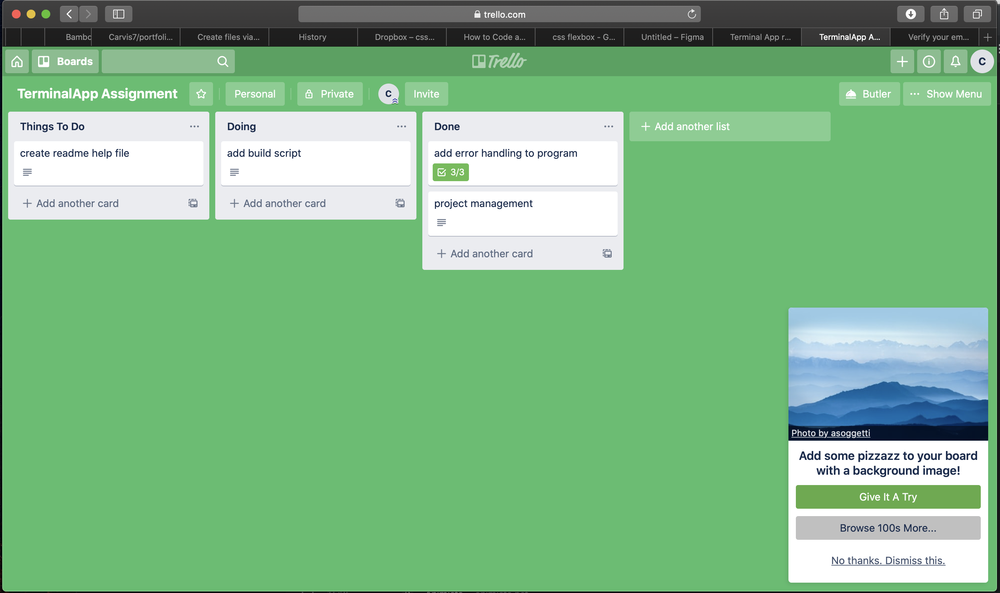
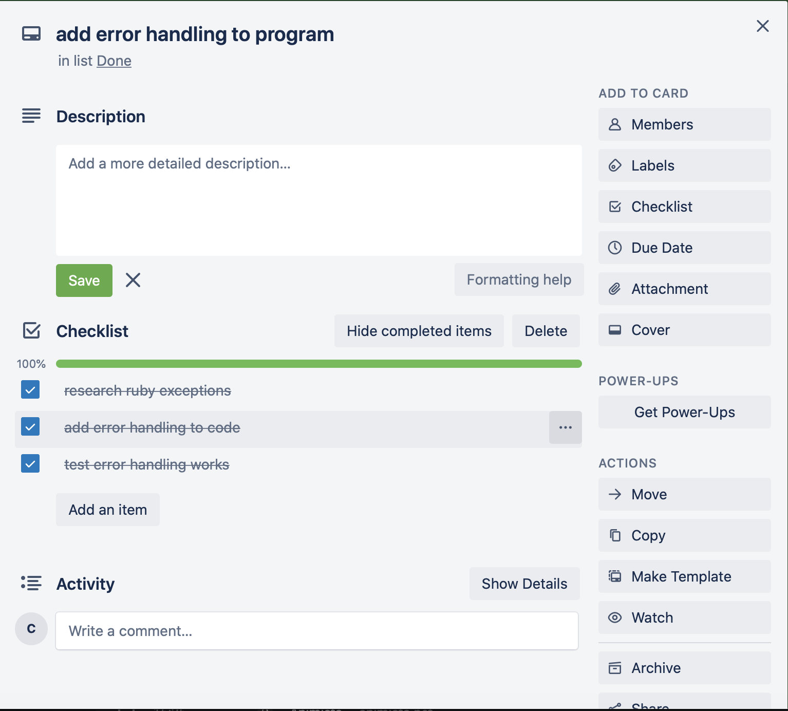
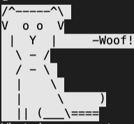

# terminalapp
coderacademyterminalappass1

A virtual pet terminal app created for Terminal App Assignmentfor Coder Academy.

The app requires the "colorize' gem.

---

# Terminal App Documentation
All documents relating to the assignment can be found in the 'TERMINALAPPASS 2' folder.
Development Plan - Development-plan.md
Control Flow Diagram - controlflowdiagram2.pdf
Tests - Tests.md

Here is a link to Trello project management software I used to track the development of my application.	

https://trello.com/b/XfIqUSm8

###Trello Screenshots




---
# How to install

Copy the directory folder and then open a terminal in the directory.
run the following in your terminal:

```bash
./build.sh
```
---
# How to play Virtual Pet

In the same terminal, input the following:

```bash
ruby terminalapp2.rb
```

The game has a hard start, so there is no menu.
The start of the game is the adoption center asking you what type of pet you would like to adopt.

Have fun!

###Here are some hints to get you going:

__Pet Stats__

Your pet has predefined stat values when you first adopt it.

The aim of the game is to get your pets "Love" points to 100.
There are many different ways to gain and even **LOSE** points.

The available (and preset) stats are:

| Name  |      Health     |  Hunger | Love |
|:-----:|:---------------:|:-------:|:----:|
| (Your Pets Name) |   60  |   50  |   30  |

You need to increase your pets love and health by doing various activities with your pet such as:
* Walking your pet
* Bathing your pet
* Picking up your pets poop

There are events that can be triggered when doing certain activities where your pet can be naughty.
When your pet is naughty, they can cause harm to themselves and will therefore lose 'love' and 'health' points.

If your pets hunger falls below 0 your pet will lose health.

If your pets health falls below 0, your pet will die and you will lose the game.

Happy Gaming!
